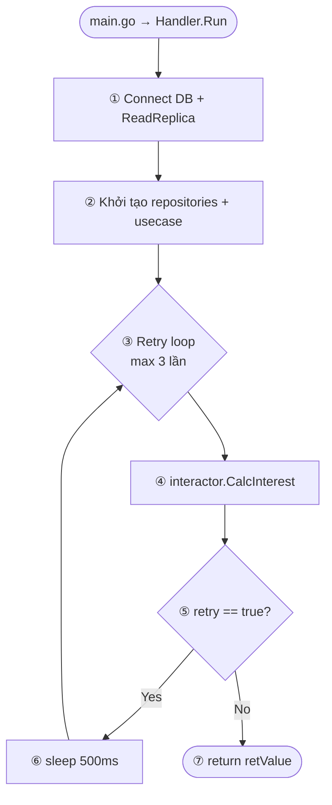
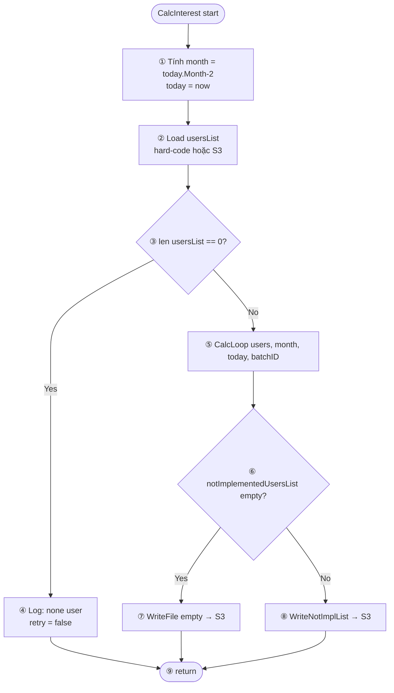
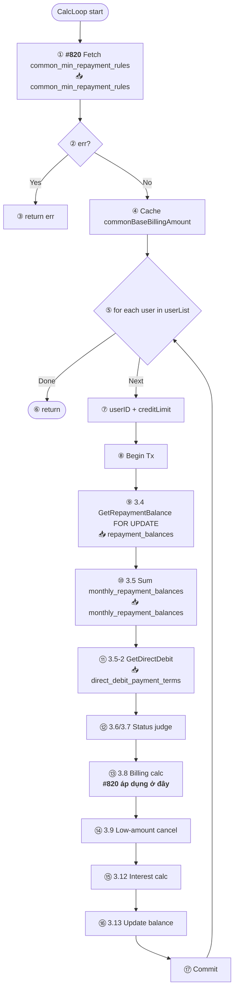
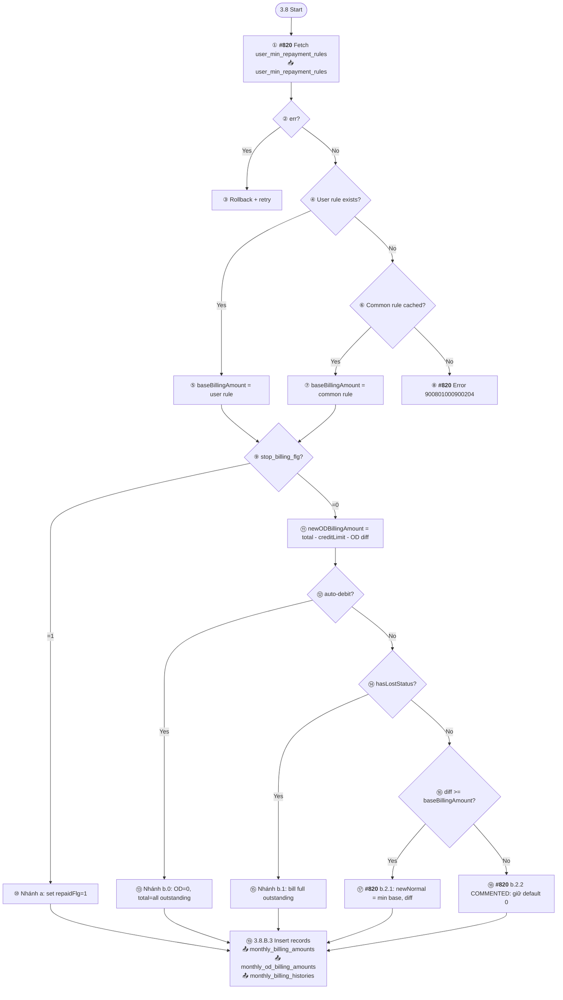
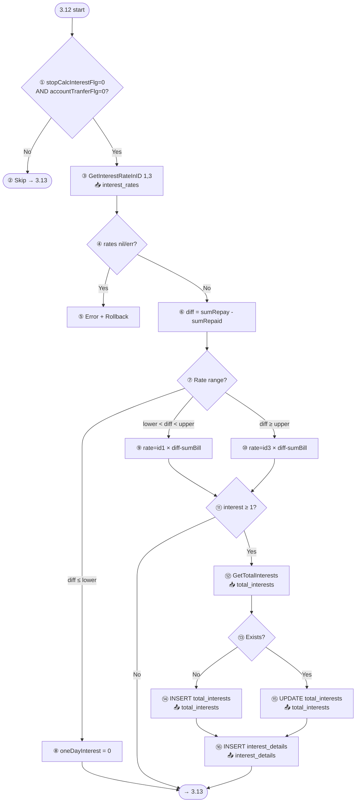
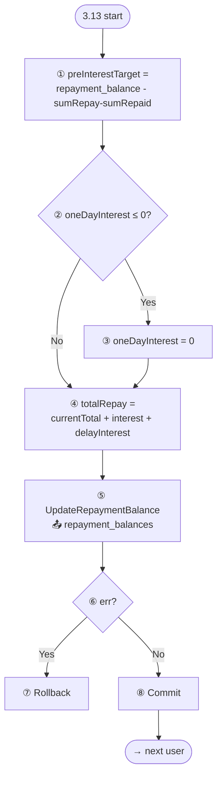
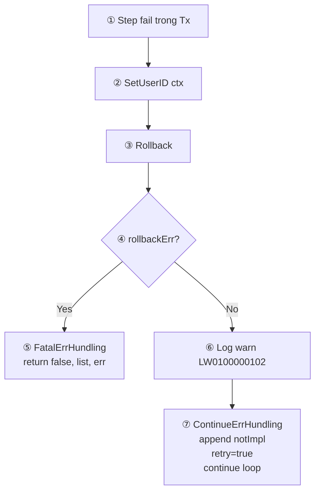
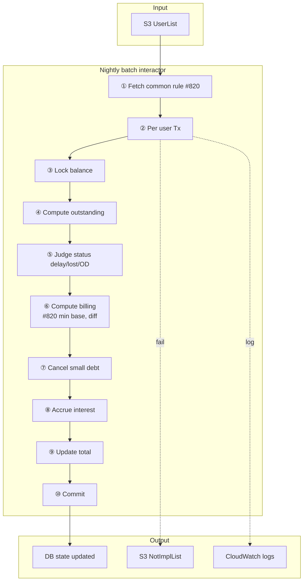

# Flow xử lý `interactor.go` — Version 2 (annotated)

Mỗi mermaid chart đi kèm **giải thích từng node** ngay bên dưới (technical + business logic).

---

## 1. Overview — Entry point

### Giải thích từng bước

| # | Step | Technical | Business logic |
|---|---|---|---|
| ① | **Connect DB** | Mở 2 connection pool: write (primary) + read replica | Tách read/write để giảm tải master DB. Interest calc đọc rất nhiều (status, history, balance) → đẩy sang replica. |
| ② | **Init dependencies** | DI pattern: Repository → Usecase → Interactor | Clean architecture — dễ mock/test từng layer. |
| ③ | **Retry loop x3** | for cnt=0; cnt<3; cnt++ | Batch chạy đêm — nếu DB glitch tạm thời (connection reset) cần tự hồi phục mà không cần Ops can thiệp. |
| ④ | **CalcInterest** | Entry point business logic | Tách khỏi handler để dễ unit test. |
| ⑤ | **Check retry flag** | Interactor trả `retry=true` khi có recoverable error | Phân biệt: lỗi transient (retry được) vs fatal (return ngay). |
| ⑥ | **Sleep 500ms** | Backoff trước retry | Tránh busy-loop khi DB đang recover. |
| ⑦ | **Return retValue** | 0 = success, 1 = fail | ECS task definition đọc exit code để kích alert. |

---

## 2. `CalcInterest` — Batch entry

### Giải thích từng bước

| # | Step | Technical | Business logic |
|---|---|---|---|
| ① | **month = today - 2 tháng** | `time.Now().Month()-2`, format YYYYMM | Nghiệp vụ **請求確定期間 2 tháng**: lãi chỉ tính trên giao dịch đã confirmed. TX tháng 4 chưa confirmed → chỉ tính TX ≤ tháng 2. |
| ② | **Load usersList** | Hard-code test hoặc download CSV từ S3 | Input của batch: danh sách user cần tính lãi hôm đó. S3 để không phụ thuộc API service. |
| ③ | **Check empty** | `len(usersList) == 0` | Edge case: file S3 rỗng (vd tất cả user đã xử lý hôm qua) → skip batch, không fail. |
| ④ | **Log none** | Debug log | Monitoring biết batch chạy nhưng không có user. |
| ⑤ | **CalcLoop** | Main processing per user | Core business logic. |
| ⑥ | **Check notImpl empty** | Users fail trong batch được append vào `notImplementedUsersList` | Output của batch — Ops cần biết ai fail để retry. |
| ⑦ | **Write empty file** | Ghi empty file lên S3 | Clear list cũ — báo "batch chạy xong không có user fail". |
| ⑧ | **Write notImpl list** | Upload CSV users fail | Batch ngày mai sẽ ưu tiên retry những user này. |
| ⑨ | **Return** | retry flag + error | Cho handler quyết định retry hay exit. |

---

## 3. `CalcLoop` — Main processing

### Giải thích từng bước

| # | Step | Technical | Business logic |
|---|---|---|---|
| ① | **Fetch common rule 1 lần** | Query `common_min_repayment_rules ORDER BY start_month DESC LIMIT 1` | #820 optimization: common rule global cho mọi user → fetch ngoài loop. Giảm N-1 DB calls khi batch 1000+ users. |
| ② | **Check err** | Nếu DB fail khi fetch common rule | Common rule là bắt buộc cho mọi user — nếu lỗi, toàn batch phải stop, không user nào chạy được. |
| ③ | **Return** | Trả err, notImplList rỗng | Retry handler sẽ thử lại. Không mark user cụ thể fail. |
| ④ | **Cache** | Lưu `commonBaseBillingAmount` + `hasCommonBaseBilling` flag | Reuse cho toàn loop users phía sau, thay vì re-query. |
| ⑤ | **For each user** | Iterate userList | Process từng user **trong transaction riêng** → 1 user fail không rollback user khác. |
| ⑥ | **Return final** | Hết user, trả về retry + notImplList | End of batch. |
| ⑦ | **Extract userID, creditLimit** | ParseInt string → int64 | Nếu creditLimit không parse được → mark notImpl ngay, không mở transaction. |
| ⑧ | **Begin Tx** | Transaction boundary per user | **Atomicity**: mọi write (balance/history/billing) của 1 user phải commit-or-rollback cùng lúc, không được partial. |
| ⑨ | **GetRepaymentBalance FOR UPDATE** | SELECT + lock row | Ngăn API user cập nhật cùng lúc → tránh race: batch cộng lãi trong khi user trả tiền → tổng sai. |
| ⑩ | **Sum monthly_repayment_balances** | SUM WHERE date_of_use ≤ month (2 tháng trước) | Tính tổng outstanding principal (trên các giao dịch đã confirmed). Base để tính lãi và billing. |
| ⑪ | **GetDirectDebit** | Fetch active auto-debit contract | Auto-debit user → nhánh xử lý riêng (b.0 trong 3.8, skip interest 3.12). |
| ⑫ | **Status judge** | Fetch + evaluate hasDelay/hasLost/hasOD/hasEntrustment/hasSuspension | Business status lifecycle: 正常 → 遅延 → 期失 → 委託/停止. Mỗi status quyết định nhánh billing. |
| ⑬ | **Billing calc** | 3.8 — quyết định `new_total_billing` | Core của issue #820. |
| ⑭ | **Low-amount cancel** | Nếu dư < ¥1000 → release status | Cost-of-collection > debt value. |
| ⑮ | **Interest calc** | Áp dụng rate tier, ghi `total_interests` + `interest_details` | Tính lãi 1 ngày. Audit trail từng ngày. |
| ⑯ | **Update balance** | UPDATE `repayment_balances.total_repayment_balance` | Commit lãi hôm nay vào tổng nợ. |
| ⑰ | **Commit Tx** | Release lock, flush writes | Atomic success per user. |

---

## 4. Section 3.8 — Billing Judgment (nhánh #820 modify)

### Giải thích từng bước

| # | Step | Technical | Business logic |
|---|---|---|---|
| ① | **Fetch user rule** | Query per user `WHERE user_id=? AND start_month≤currentMonth` | User VIP hoặc user có thoả thuận đặc biệt → override common rule. |
| ② | **Check err** | DB query error | User này không xử lý được → rollback, đánh retry. Không dùng giá trị mặc định (tránh billing sai). |
| ③ | **Rollback** | ROLLBACK current user transaction | Đảm bảo không có partial write. |
| ④ | **User rule exists?** | `len(userMinRepaymentRules) > 0` | Priority logic: user > common. |
| ⑤ | **Use user rule** | `baseBillingAmount = userRule.MinRepaymentAmount` | Áp dụng thoả thuận cá nhân. |
| ⑥ | **Common rule cached?** | Dùng flag từ bước CalcLoop ① | Fallback khi user không có rule riêng. |
| ⑦ | **Use common rule** | `baseBillingAmount = commonBaseBillingAmount` | Policy mặc định cho mọi user. |
| ⑧ | **Error no rule** | `errm.Wrap1 900801000900204` + rollback | **Safety guard**: không có rule nào → fail an toàn thay vì dùng giá trị sai. Ops phải INSERT rule rồi retry. |
| ⑨ | **stop_billing_flg?** | `repayment_status_controls.stop_billing_flg == 1` | Admin tạm ngừng billing (dispute, bug, customer service request). |
| ⑩ | **Nhánh a** | `repaidFlg=1, repaidOdFlg=1`, patch existing rows | User không thấy invoice mới — đánh dấu "đã trả" để loop sau không revisit. |
| ⑪ | **Compute newODBilling** | `total_repayment_balance - creditLimit - (sumNewOD - sumRepaidOD)`, clamp ≥ 0 | OD = số tiền user vượt credit limit. Dương → cần bill; âm → dưới limit, OD = 0. |
| ⑫ | **auto-debit?** | `accountTranferFlg == 1` | User đã đăng ký kéo tiền tự động. |
| ⑬ | **Nhánh b.0** | OD=0, bill toàn bộ outstanding | Auto-debit kéo toàn bộ — không cần chia OD/normal, không cần notification billing. |
| ⑭ | **hasLostStatus?** | Có row `repayment_statuses.repayment_status_id = '003'` | User đã 期失 (vỡ nợ, quá hạn 3 tháng + notice sent). |
| ⑮ | **Nhánh b.1** | `newTotalBilling = total - sumBill`, newNormal = total - OD | Đã vỡ nợ → đòi toàn bộ, không có khái niệm "trả tối thiểu" nữa. |
| ⑯ | **diff >= baseBilling?** | diff = outstanding principal - unpaid billing | Nếu dư nợ còn đủ lớn để đòi ít nhất 1 kỳ minimum → vào b.2.1. |
| ⑰ | **b.2.1 (modified #820)** | `newNormal = min(baseBilling, diff)` | **Normal case**: đòi min payment — nhưng không quá dư nợ (`min()` cap). ` `Trước: hardcode 1000. Sau: dynamic từ `baseBillingAmount`. |
| ⑱ | **b.2.2 (commented #820)** | Không vào nhánh nào → giữ `newTotal=0, newNormal=0` | Spec đánh 分岐不要. Khi diff < baseBilling → scenario hiếm (user đã được cancel ở 3.9). Code cũ có gán `newTotal=newOD` — code mới giữ 0. |
| ⑲ | **Insert records** | INSERT 3 tables | Persist kết quả tháng này. `monthly_billing_histories` giữ audit log cho legal. |

---

## 5. Section 3.12 — Interest Calculation

### Giải thích từng bước

| # | Step | Technical | Business logic |
|---|---|---|---|
| ① | **Guard conditions** | `stopCalcInterestFlg=0 AND accountTranferFlg=0` | 2 scenario skip: (a) admin ngừng lãi (customer service); (b) auto-debit user (tính lãi ở pipeline khác). |
| ② | **Skip** | Bypass interest calc | Không ghi `total_interests`, không tăng `total_repayment_balance` từ interest. |
| ③ | **Fetch rates** | Query `interest_rates IN (1,3)` | Tier rate: id=1 (thấp, cho nợ nhỏ), id=3 (cao, cho nợ lớn — theo Japan Interest Rate Act). |
| ④ | **Check err/nil** | Rate không có → không tính lãi được | Data integrity — rate là master data phải có. |
| ⑤ | **Error + rollback** | Wrap `900801000900204` | Ops phải kiểm tra lại seed data. |
| ⑥ | **Compute diff** | `sumRepayment - sumRepaid` = outstanding principal | Base để tính lãi. |
| ⑦ | **Determine range** | So sánh với lower_limit, upper_limit | Tier-based rate. |
| ⑧ | **Below lower → 0 interest** | Nợ quá nhỏ | Policy: dưới ngưỡng không tính lãi (vd ¥1000 rounding). |
| ⑨ | **Tier 1 rate** | `interest = rate × (diff - sumBill) / scale` | Nợ trung bình → rate thấp. Lưu ý: trừ `sumBill` (đã bill rồi) để không tính lãi 2 lần. |
| ⑩ | **Tier 3 rate** | `interest = rate3 × (diff - sumBill)` | Nợ cao → rate cao (Japan regulation). |
| ⑪ | **interest ≥ 1?** | Interest tính ra < 1 yen → skip | Rounding: không ghi row cho khoản lãi ≤ 0. |
| ⑫ | **Fetch total_interests** | Check user đã có row chưa | Quyết định INSERT vs UPDATE. |
| ⑬ | **Exists?** | `len(totalInterests) == 0` | Lần đầu tháng này hay không. |
| ⑭ | **INSERT total_interests** | Row mới với `total_interest = oneDayInterest` | Start accumulate tháng mới. |
| ⑮ | **UPDATE total_interests** | `total_interest += oneDayInterest` | Cộng dồn lãi các ngày trong tháng. |
| ⑯ | **INSERT interest_details** | Row mỗi ngày: base, rate, interest | **Legal audit**: khi user dispute lãi, cần show từng ngày tính bao nhiêu. |

---

## 6. Section 3.13 — Update repayment_balances

### Giải thích từng bước

| # | Step | Technical | Business logic |
|---|---|---|---|
| ① | **preInterestTarget** | `repayment_balance - (sumRepay - sumRepaid)` | Snapshot principal đang chịu lãi trước khi cộng interest hôm nay. Dùng cho delta tracking. |
| ② | **Check interest ≤ 0** | Guard âm | Lỡ tính ra âm (decimal edge case) → treat as 0. |
| ③ | **Clamp to 0** | `oneDayInterest = 0` | Không bao giờ trừ `total_repayment_balance`. |
| ④ | **Compute new total** | `current + interest + delayInterest` | Tổng nợ mới = nợ cũ + lãi thường + lãi phạt trễ. |
| ⑤ | **UPDATE balance** | `UPDATE repayment_balances SET total, interest_target, pre_interest_target` | Source of truth — frontend app sẽ đọc bảng này để show số nợ user. |
| ⑥ | **Check err** | UPDATE fail (vd connection) | Phải rollback toàn bộ transaction (3.5-3.13). |
| ⑦ | **Rollback** | Hủy mọi write của user | `total_interests` cũng bị rollback → không double charge khi retry. |
| ⑧ | **Commit** | Release lock row `FOR UPDATE` từ 3.4 | Atomic finish. Các API user-facing đọc thấy giá trị mới. |

---

## 7. Error handling pattern

### Giải thích từng bước

| # | Step | Technical | Business logic |
|---|---|---|---|
| ① | **Step fail** | Bất kỳ DB call / logic error | Không crash batch — đưa user này vào danh sách skip. |
| ② | **SetUserID ctx** | Gán userID vào context cho log | Log có userID → Ops biết user nào fail. |
| ③ | **Rollback** | Hủy transaction | Không để partial write làm sai data. |
| ④ | **Check rollbackErr** | Rollback cũng fail → DB connection chết | Nặng hơn — không tiếp tục được. |
| ⑤ | **Fatal handling** | Return ngay, không process user còn lại | Toàn bộ batch fail → handler retry. |
| ⑥ | **Log warn** | `LW0100000102` code | Standard warning format — dashboard CloudWatch. |
| ⑦ | **Continue handling** | Append user vào `notImplementedUsersList`, set retry=true, continue loop | User khác vẫn chạy. User fail này sẽ retry ngày mai (hoặc trong 3 lần retry của handler). |

---

## 8. Đồ thị tổng (business view)

### Tóm tắt business outcomes

| Output | Ý nghĩa |
|---|---|
| `repayment_balances` updated | User thấy số nợ mới (+interest) trong app |
| `monthly_billing_amounts` inserted | Billing tháng mới được sinh — hiển thị trên statement |
| `total_interests` / `interest_details` | Audit trail lãi từng ngày — đáp ứng legal/dispute |
| `repayment_status_histories` | Lịch sử status — legal compliance |
| S3 NotImplList | Ops list — retry thủ công hoặc investigate |
| CloudWatch warn LW0100000102 | Monitoring alert nếu số warn vượt threshold |
