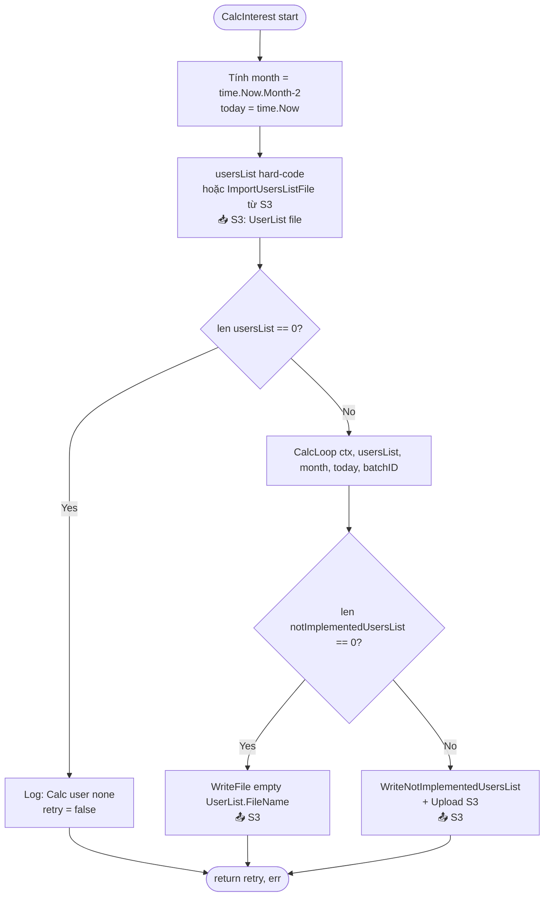
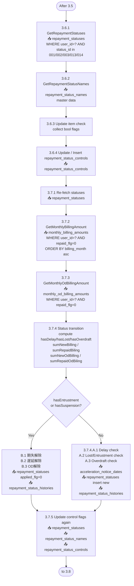
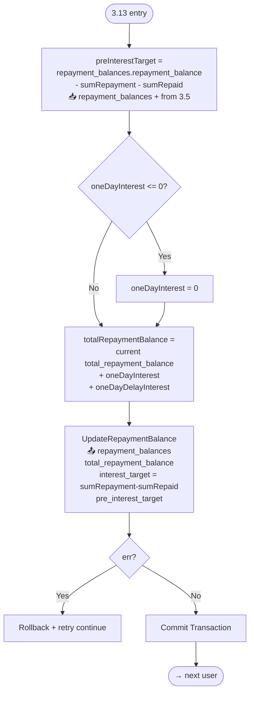
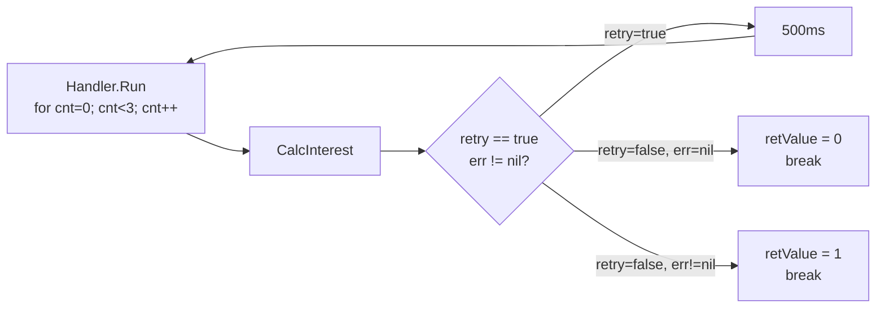
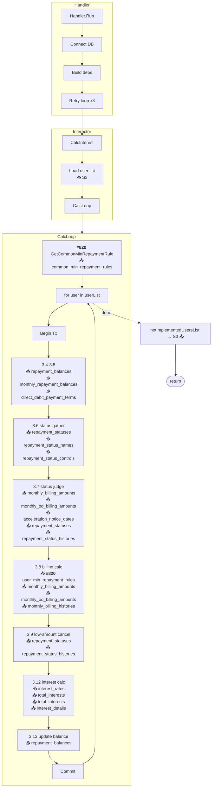
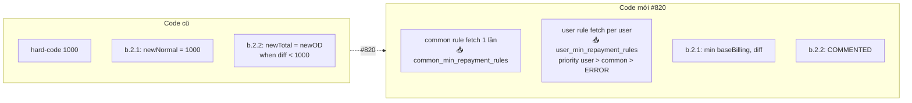

# Flow xử lý `app/repayment/usecase/interactor.go`

Tài liệu tóm tắt flow theo section spec `Nudge-バッチ仕様書_金利計算バッチ`, có annotate **table nguồn** cho từng bước.

> 📥 = READ (query), 📤 = WRITE (insert/update/delete).

---

## 1. Overview — Entry point

---

## 2. `CalcInterest` — Batch entry (line 55)

---

## 3. `CalcLoop` — Main processing (line 303)

---

## 4. Section 3.6 – 3.7 — Status gathering & judgment

---

## 5. Section 3.8 — 請求額判定 (Billing Judgment) — Nhánh bị thay đổi #820

---

## 6. Section 3.9 — 少額ユーザ 請求取消

---

## 7. Section 3.12 — 利息計算 (Interest Calc)

---

## 8. Section 3.13 — Update `repayment_balances`

---

## 9. Error handling pattern (chung cho mọi step)

---

## 10. Retry strategy

---

## 11. Tổng thể end-to-end (zoom out)

---

## 12. Điểm thay đổi của Issue #820 (highlighted)

| Nơi | Trước | Sau | Table mới |
|---|---|---|---|
| Đầu `CalcLoop` (line 304-318) | — | Fetch **1 lần** / batch | 📥 `common_min_repayment_rules` |
| Trong for-user (line 1849-1899) | Hard-code `1000` | Priority user > common > error | 📥 `user_min_repayment_rules` |
| `b.2.1` (line 2018-2037) | `newNormalBilling = 1000` | `min(baseBillingAmount, diff)` | — |
| `b.2.2` (line 2039-2050) | `newTotalBilling = newOD` `newNormalBilling = 0` | **Comment out** (分岐不要) — giữ default 0 | — |

---

## 13. Reference: Full table usage matrix

| Table | Read (📥) | Write (📤) | Section |
|---|---|---|---|
| `users` | user_id, credit_limit (từ S3 / hardcode) | — | 3.3 |
| `repayment_balances` | repayment_balance, total_repayment_balance, interest_target, pre_interest_target | total_repayment_balance, interest_target, pre_interest_target | 3.4, 3.13 |
| `monthly_repayment_balances` | SUM(repayment_balance), SUM(repayed_balance) WHERE date_of_use≤month AND repayed_flg=0 | — | 3.5 |
| `direct_debit_payment_terms` | status=2, apply_start≤today, apply_end>today | — | 3.5-2 |
| `repayment_statuses` | repayment_status_id, applied_flg | applied_flg=0 (cancel), insert new status | 3.6.1, 3.7.1, 3.7.4.A.\*, 3.7.5.1, 3.9.1, 3.9.2 |
| `repayment_status_names` | master data | — | 3.6.2, 3.7.5.2 |
| `repayment_status_controls` | stop_billing_flg, stop_calc_interest_flg, stop_calc_late_charge_flg | các stop_* flags | 3.6.4, 3.7.5.4, 3.8.B.1 |
| `repayment_status_histories` | — | history log khi thay đổi status | 3.7.4.\*, 3.9 |
| `monthly_billing_amounts` | WHERE user_id AND repaid_flg=0, new_total_billing, repaid_billing, billing_month | INSERT new row (new_total_billing, new_normal_billing); PATCH repaid_flg | 3.7.2, 3.8.B.2/3 |
| `monthly_od_billing_amounts` | WHERE user_id AND repaid_flg=0, new_od_billing, repaid_od_billing | INSERT new row; PATCH repaid_flg | 3.7.3, 3.8.B.2/3 |
| `monthly_billing_histories` | — | INSERT: billing, repaid_amount, base_amount, total_repayment_balance, billing_month | 3.8.B.3 |
| `acceleration_notice_dates` | acceleration_month → check 期失通知 | — | 3.7.4.A.2.1.2 |
| `interest_rates` | id=1, id=3 → upper_limit, lower_limit, interest_rate | — | 3.12 |
| `total_interests` | total_interest (check tồn tại) | INSERT / UPDATE total_interest | 3.12.4, 3.12.5 |
| `interest_details` | — | INSERT: day, base_amount, interest_rate, interest | 3.12.4.1 |
| `total_late_charges` | — | (used in late-charge path, not core to #820) | 3.10 |
| `late_charge_detail` | — | (used in late-charge path) | 3.10 |
| `unapplied_repayments` | — | (used in repay-apply path) | 3.11 |
| **`common_min_repayment_rules`** 🆕 | start_month ≤ currentMonth, min_repayment_amount, ORDER start_month DESC LIMIT 1 | — | #820 — line 304-318 |
| **`user_min_repayment_rules`** 🆕 | WHERE user_id AND start_month ≤ currentMonth, min_repayment_amount | — | #820 — line 1849-1868 |
| S3 bucket | UserList.FileName (user list input) | NotImplementedUsersList output | Entry / End |
