# Flow xử lý `app/repayment/usecase/interactor.go`

Tài liệu tóm tắt flow theo section spec `Nudge-バッチ仕様書_金利計算バッチ`. Mermaid render sẵn trên GitHub/GitLab.

---

## 1. Overview — Entry point

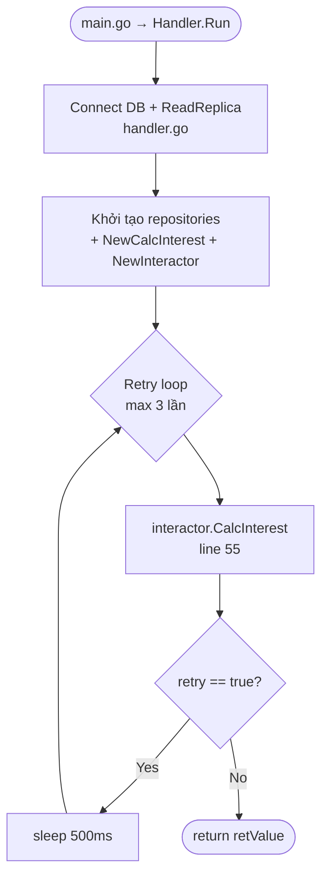

---

## 2. `CalcInterest` — Batch entry (line 55)

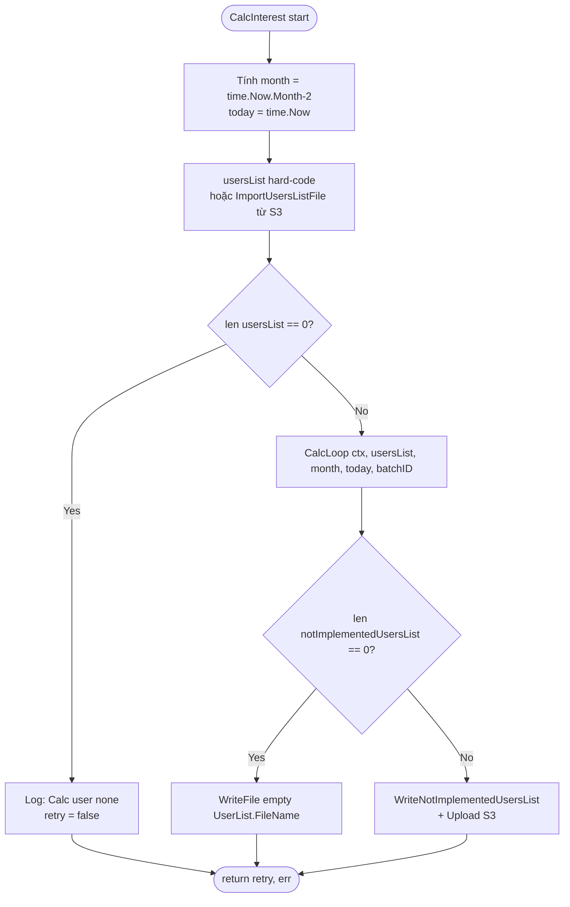

---

## 3. `CalcLoop` — Main processing (line 303)

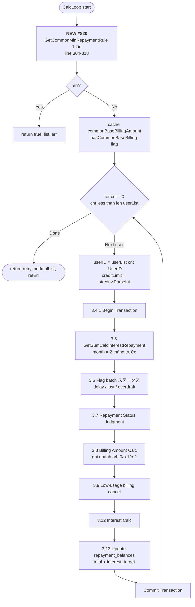

---

## 4. Section 3.6–3.7 — Status gathering & judgment

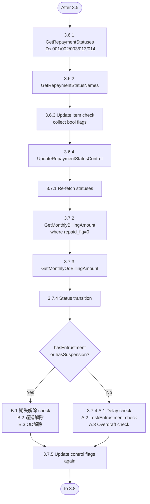

---

## 5. Section 3.8 — 請求額判定 (Billing Judgment) — Nhánh bị thay đổi #820

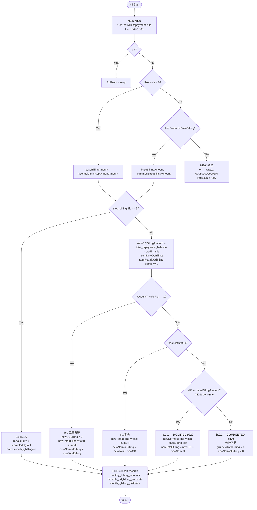

---

## 6. Section 3.9 — 少額ユーザ 請求取消

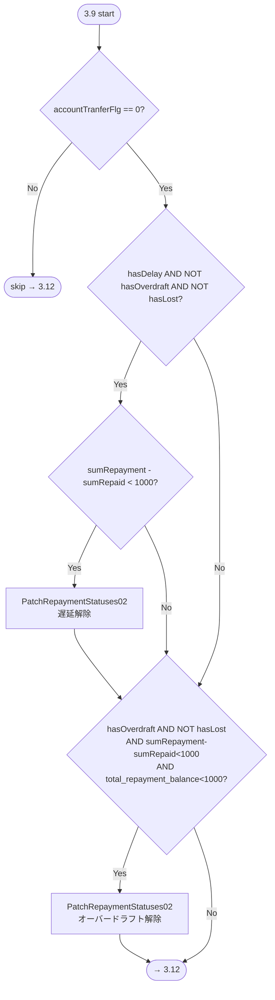

---

## 7. Section 3.12 — 利息計算 (Interest Calc)

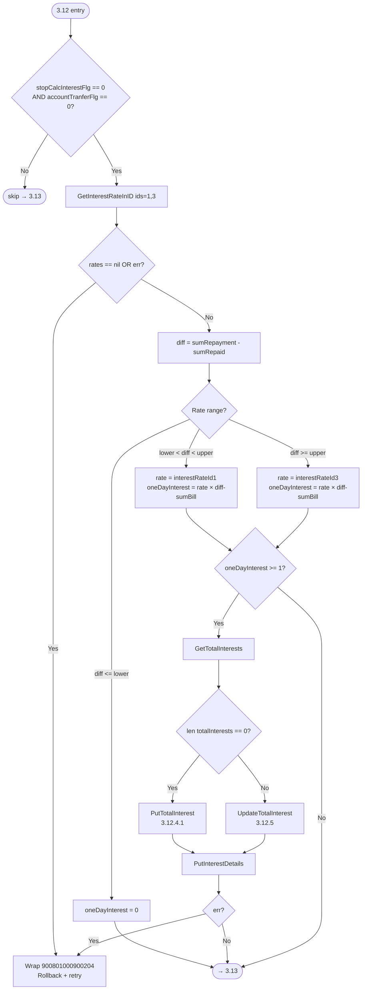

---

## 8. Section 3.13 — Update `repayment_balances`

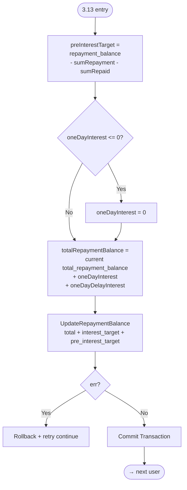

---

## 9. Error handling pattern (chung cho mọi step)

---

## 10. Retry strategy

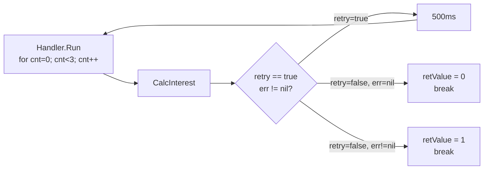

---

## 11. Tổng thể end-to-end (zoom out)

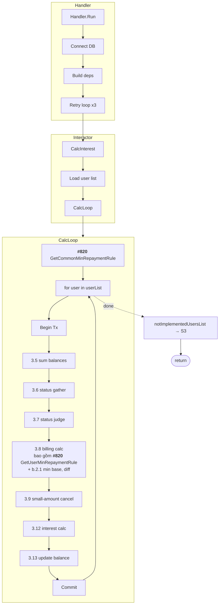

---

## 12. Điểm thay đổi của Issue #820 (highlighted)

| Nơi | Trước | Sau |
|---|---|---|
| Đầu `CalcLoop` (line 304-318) | — | Fetch `common_min_repayment_rules` **1 lần** / batch |
| Trong for-user (line 1849-1899) | Hard-code `1000` | Fetch `user_min_repayment_rules` → priority user > common > **error 900801000900204** |
| `b.2.1` (line 2018-2037) | `newNormalBilling = 1000` | `newNormalBilling = min(baseBillingAmount, diff)` |
| `b.2.2` (line 2039-2050) | `newTotalBilling = newODBilling` `newNormalBilling = 0` | **Comment out** (分岐不要) — giữ default 0 |

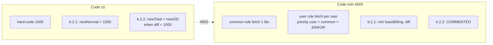
