# Flow xử lý `app/repayment/usecase/interactor.go`

Tài liệu tóm tắt flow theo section spec `Nudge-バッチ仕様書_金利計算バッチ`, có annotate **table nguồn** cho từng bước.

> 📥 = READ (query), 📤 = WRITE (insert/update/delete).

---

## 1. Overview — Entry point


---

## 2. `CalcInterest` — Batch entry (line 55)


---

## 3. `CalcLoop` — Main processing (line 303)

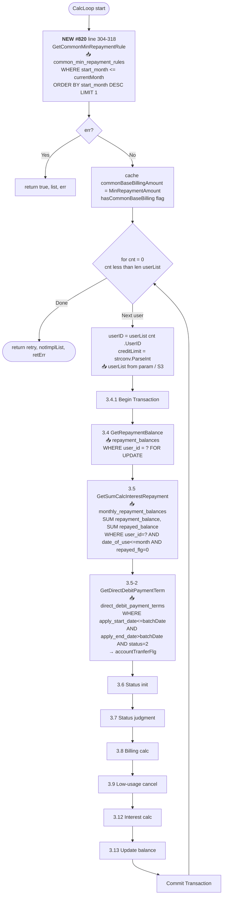

---

## 4. Section 3.6 – 3.7 — Status gathering & judgment


---

## 5. Section 3.8 — 請求額判定 (Billing Judgment) — Nhánh bị thay đổi #820

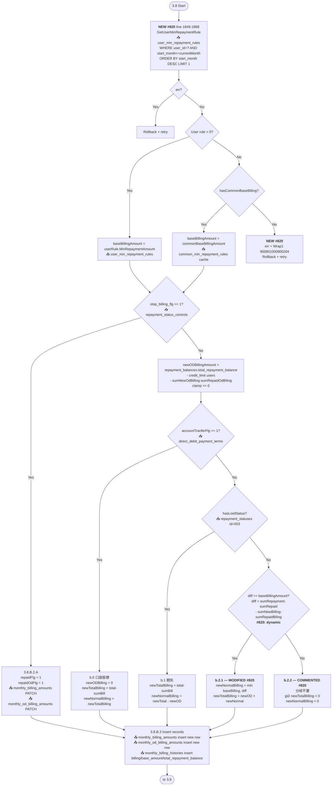

---

## 6. Section 3.9 — 少額ユーザ 請求取消

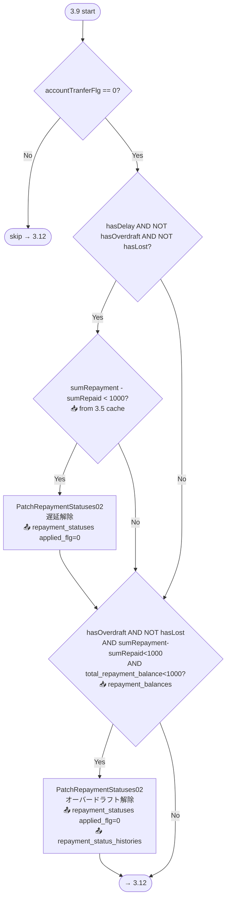

---

## 7. Section 3.12 — 利息計算 (Interest Calc)

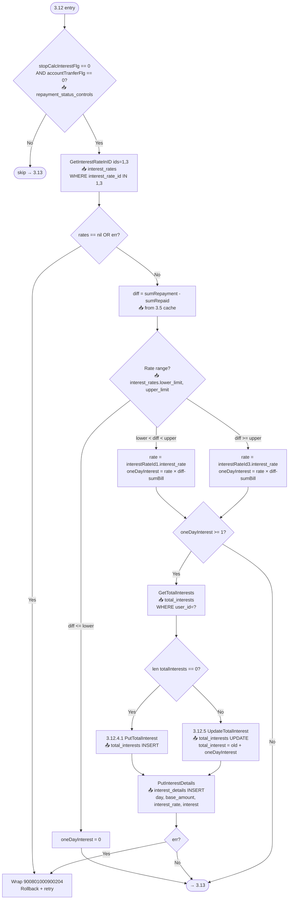

---

## 8. Section 3.13 — Update `repayment_balances`


---

## 9. Error handling pattern (chung cho mọi step)

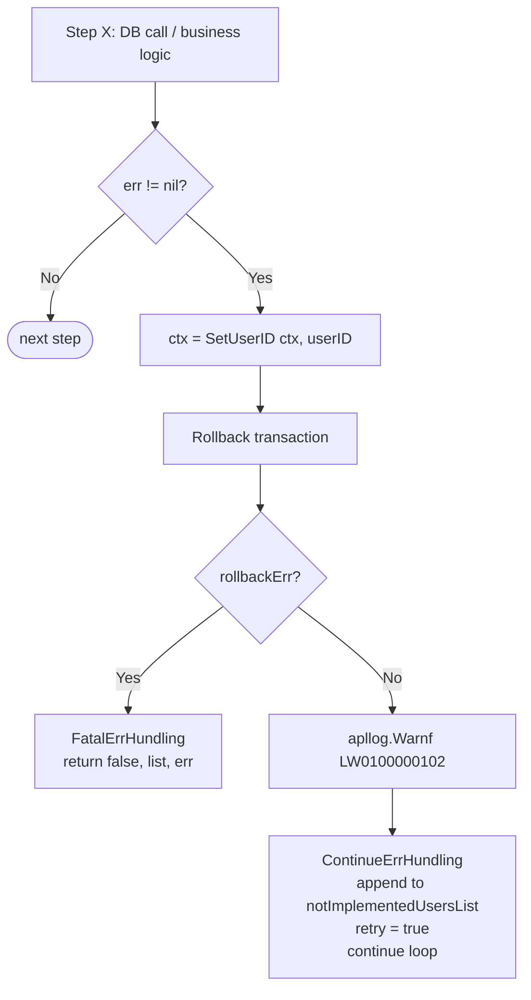

---

## 10. Retry strategy

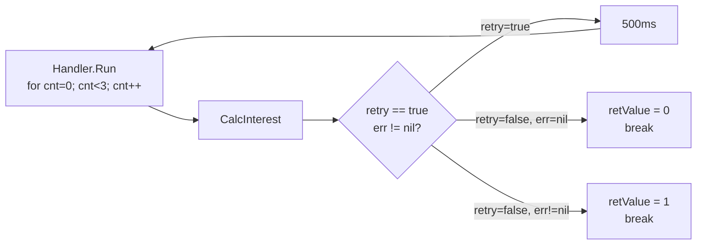

---

## 11. Tổng thể end-to-end (zoom out)


---

## 12. Điểm thay đổi của Issue #820 (highlighted)

| Nơi | Trước | Sau | Table mới |
|---|---|---|---|
| Đầu `CalcLoop` (line 304-318) | — | Fetch **1 lần** / batch | 📥 `common_min_repayment_rules` |
| Trong for-user (line 1849-1899) | Hard-code `1000` | Priority user > common > error | 📥 `user_min_repayment_rules` |
| `b.2.1` (line 2018-2037) | `newNormalBilling = 1000` | `min(baseBillingAmount, diff)` | — |
| `b.2.2` (line 2039-2050) | `newTotalBilling = newOD`<br/>`newNormalBilling = 0` | **Comment out** (分岐不要) — giữ default 0 | — |

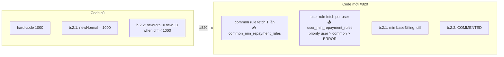

---

## 13. Reference: Full table usage matrix

| Table | Read (📥) | Write (📤) | Section |
|---|---|---|---|
| `users` | user_id, credit_limit (từ S3 / hardcode) | — | 3.3 |
| `repayment_balances` | repayment_balance, total_repayment_balance, interest_target, pre_interest_target | total_repayment_balance, interest_target, pre_interest_target | 3.4, 3.13 |
| `monthly_repayment_balances` | SUM(repayment_balance), SUM(repayed_balance) WHERE date_of_use≤month AND repayed_flg=0 | — | 3.5 |
| `direct_debit_payment_terms` | status=2, apply_start≤today, apply_end>today | — | 3.5-2 |
| `repayment_statuses` | repayment_status_id, applied_flg | applied_flg=0 (cancel), insert new status | 3.6.1, 3.7.1, 3.7.4.A.\*, 3.7.5.1, 3.9.1, 3.9.2 |
| `repayment_status_names` | master data | — | 3.6.2, 3.7.5.2 |
| `repayment_status_controls` | stop_billing_flg, stop_calc_interest_flg, stop_calc_late_charge_flg | các stop_* flags | 3.6.4, 3.7.5.4, 3.8.B.1 |
| `repayment_status_histories` | — | history log khi thay đổi status | 3.7.4.\*, 3.9 |
| `monthly_billing_amounts` | WHERE user_id AND repaid_flg=0, new_total_billing, repaid_billing, billing_month | INSERT new row (new_total_billing, new_normal_billing); PATCH repaid_flg | 3.7.2, 3.8.B.2/3 |
| `monthly_od_billing_amounts` | WHERE user_id AND repaid_flg=0, new_od_billing, repaid_od_billing | INSERT new row; PATCH repaid_flg | 3.7.3, 3.8.B.2/3 |
| `monthly_billing_histories` | — | INSERT: billing, repaid_amount, base_amount, total_repayment_balance, billing_month | 3.8.B.3 |
| `acceleration_notice_dates` | acceleration_month → check 期失通知 | — | 3.7.4.A.2.1.2 |
| `interest_rates` | id=1, id=3 → upper_limit, lower_limit, interest_rate | — | 3.12 |
| `total_interests` | total_interest (check tồn tại) | INSERT / UPDATE total_interest | 3.12.4, 3.12.5 |
| `interest_details` | — | INSERT: day, base_amount, interest_rate, interest | 3.12.4.1 |
| `total_late_charges` | — | (used in late-charge path, not core to #820) | 3.10 |
| `late_charge_detail` | — | (used in late-charge path) | 3.10 |
| `unapplied_repayments` | — | (used in repay-apply path) | 3.11 |
| **`common_min_repayment_rules`** 🆕 | start_month ≤ currentMonth, min_repayment_amount, ORDER start_month DESC LIMIT 1 | — | #820 — line 304-318 |
| **`user_min_repayment_rules`** 🆕 | WHERE user_id AND start_month ≤ currentMonth, min_repayment_amount | — | #820 — line 1849-1868 |
| S3 bucket | UserList.FileName (user list input) | NotImplementedUsersList output | Entry / End |

---

# Version 2 — Flow + Business Logic

Phần này bổ sung **WHY** (nghiệp vụ đằng sau) cho từng step. Version 1 ở trên trả lời **WHAT/HOW** (kỹ thuật).

## V2.1 — Bối cảnh nghiệp vụ tổng quan

Batch `bt-intcalc` là **金利計算バッチ** (Interest Calculation Batch), chạy **mỗi ngày** để:

1. **Tính lãi hàng ngày** cho từng khoản vay (sumRepaymentBalance × interest_rate).
2. **Sinh request billing** hàng tháng cho user (số tiền tối thiểu phải trả).
3. **Cập nhật trạng thái nợ**: phát hiện trễ hạn (delay), vỡ nợ (lost/期失), vượt hạn mức (overdraft).
4. **Xử lý miễn trừ**: user đăng ký 口座振替 (auto-debit), user nợ nhỏ (< ¥1000) được cancel billing.

**Stakeholder & constraint:**
- Legal/Compliance: phải log đầy đủ lịch sử thay đổi status (`repayment_status_histories`).
- Ops: nếu 1 user fail, **không** được block toàn batch — chỉ mark user đó vào `notImplementedUsersList` để retry thủ công.
- Performance: có thể chạy với **1000+ users/đêm** → tối ưu query (#820 split common rule fetch).

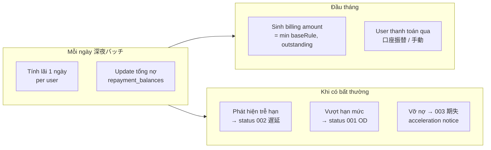

---

## V2.2 — Business logic cho từng section

### 3.4 — GetRepaymentBalance (với `FOR UPDATE`)


**Business reason:**
- `repayment_balances` là **source of truth** cho tổng dư nợ.
- Nếu API user-facing cập nhật cùng lúc → race condition → tính lãi sai.
- `SELECT FOR UPDATE` lock row cho đến Commit/Rollback → atomic per-user.

---

### 3.5 — SUM monthly_repayment_balances với `date_of_use <= month-2`

**Business reason:**
- `month` truyền vào = `time.Now().Month() - 2` (2 tháng trước) — KHÔNG phải tháng hiện tại.
- Nghiệp vụ: **利息は利用確定後に課す** (lãi chỉ tính sau khi giao dịch đã confirmed). Thẻ tín dụng có 請求確定期間 khoảng 2 tháng → chỉ tính lãi trên phần **đã confirmed**.
- Do đó `date_of_use <= '202602'` (khi chạy 2026-04) nghĩa là: "tính lãi trên các giao dịch đã confirmed đến hết tháng 2".

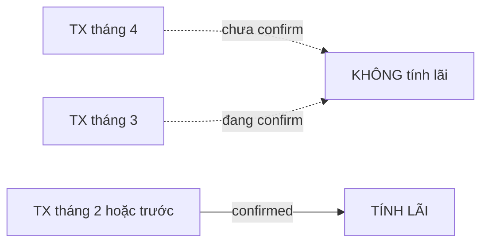

---

### 3.5-2 — direct_debit_payment_terms → `accountTranferFlg`

**Business reason:**
- User đăng ký 口座振替 (auto-debit từ tài khoản ngân hàng) được đối xử **khác** trong mọi bước downstream:
  - **3.8**: không sinh OD billing (tiền sẽ bị debit tự động, không cần notify)
  - **3.9**: cho phép cancel billing nhỏ (vì auto-debit sẽ tự refund qua clearing)
  - **3.12**: **không** tính lãi bằng batch (đã tính riêng trong direct-debit flow)
- Nếu user có thay đổi kế hoạch auto-debit, cột `status='2'` = active contract.

---

### 3.6 – 3.7 — Status judgment (delay / lost / overdraft)

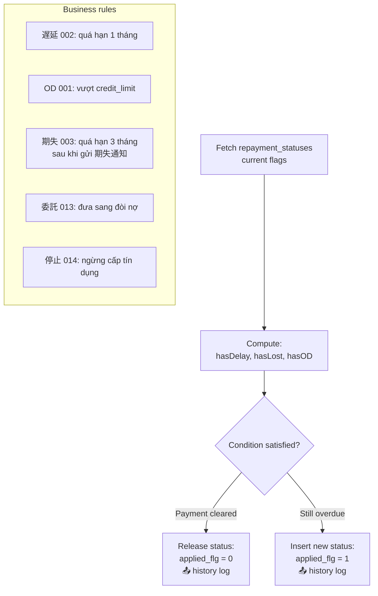

**Business reason:**
- Status **lifecycle**: 正常 → 遅延 (quá 1 tháng) → 期失 (quá 3 tháng + notice sent) → 委託/停止.
- Mỗi lần chuyển status phải ghi `repayment_status_histories` (legal requirement: truy xuất lịch sử nợ).
- Nếu user trả hết → tự động `applied_flg=0` (release status) thay vì DELETE → giữ lịch sử.

---

### 3.8 — Billing Judgment (phần được modify #820)

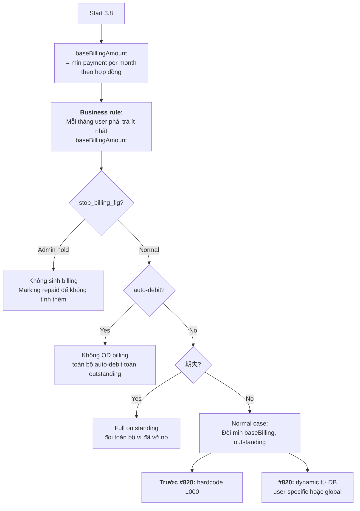

**Business reason các nhánh:**

| Nhánh | Scenario | Business logic |
|---|---|---|
| **a) stop_billing_flg=1** | Admin tạm dừng billing (vd: bug, dispute) | Không sinh request → user không thấy invoice mới. Đánh `repaid_flg=1` để loop sau không revisit. |
| **b.0) account_transfer_flg=1** | User đã đăng ký 口座振替 | OD không cần vì auto-debit sẽ kéo tiền về. `newTotalBilling = total outstanding` (debit full amount). |
| **b.1) hasLostStatus** | User đã 期失 (vỡ nợ, quá 3 tháng) | Đòi toàn bộ dư nợ còn lại — không có khái niệm "trả tối thiểu" nữa. |
| **b.2) Normal case** | User thường, chưa vỡ nợ, không auto-debit | Đòi `min(baseBillingAmount, diff)` — đảm bảo user trả tối thiểu nhưng không quá dư nợ. |

**Tại sao #820 phải dynamic baseBillingAmount?**

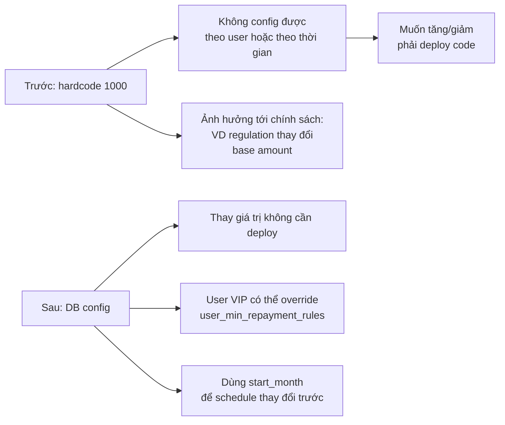

**Tại sao b.2.2 bị comment (分岐不要)?**

- b.2.2 cũ: khi `diff < 1000` → `newTotalBilling = newODBilling`, `newNormalBilling = 0`.
- Nghiệp vụ sau review: scenario này **hiếm xảy ra** với logic upstream (nếu diff < 1000, thường đã được cancel ở 3.9). Giữ default `0` thay vì chạy nhánh riêng → đơn giản hoá.
- ⚠ Vẫn cần PM confirm: nếu có user OD nhưng diff < baseBilling, code mới sẽ **không** bill OD phần đó nữa.

---

### 3.9 — Low-amount billing cancel (<¥1000)

**Business reason:**
- Khi dư nợ < ¥1000 và user ở trạng thái 遅延/OD, batch tự động release status.
- Lý do: chi phí đòi ¥1000 > giá trị nợ. Rounding policy.
- CHỈ áp dụng cho **auto-debit user** (`accountTranferFlg=0` ngược nghĩa — xem lại code: actually condition là `accountTranferFlg == 0` tức **không auto-debit**).

---

### 3.12 — Interest Calculation

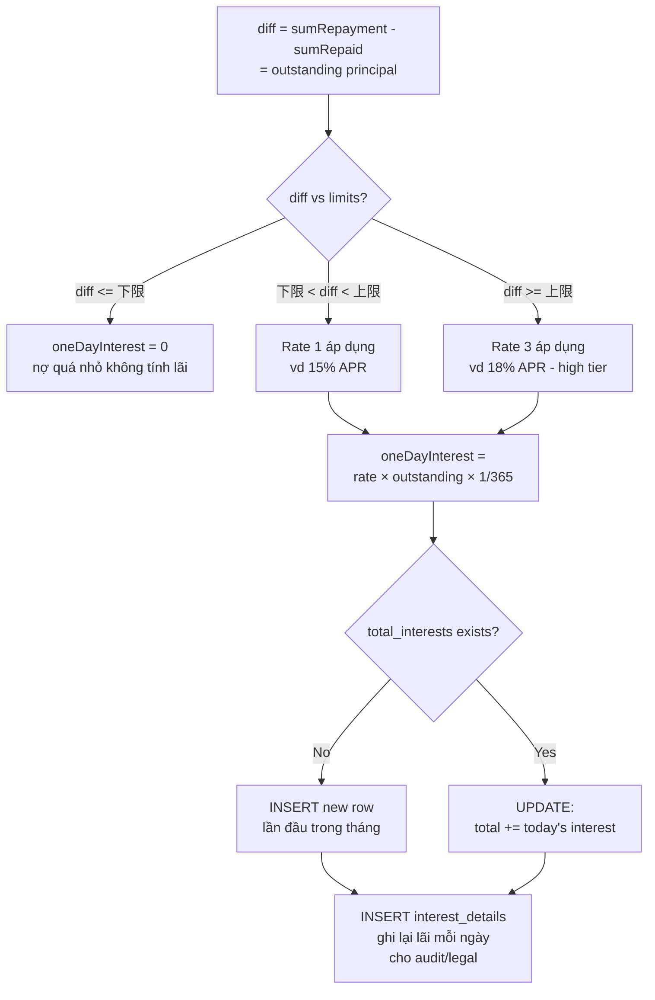

**Business reason:**
- **Tiered rate**: Japan Interest Rate Act — nợ lớn có lãi suất cao hơn theo tầng. `interest_rates` table config 2 tier (id=1 thấp, id=3 cao).
- **Per-day calc**: `rate × diff / 365` (lãi đơn ngày) → cộng dồn vào `total_interests` hàng tháng. Cuối tháng, total_interest sẽ thành 1 billing entry cho tháng sau.
- **`interest_details` audit log**: mỗi ngày 1 row với base_amount + rate + interest → required for dispute handling.
- **Guard điều kiện `stopCalcInterestFlg=0 && accountTranferFlg=0`**: admin có thể ngừng lãi (customer service), auto-debit user đã tính lãi ở pipeline khác.

---

### 3.13 — Update repayment_balances

**Business reason:**
- Sau khi cộng lãi ngày hôm nay, `total_repayment_balance` = tổng nợ mới (principal + interest + late_charge).
- `interest_target` = principal chưa trả (base để tính lãi ngày mai).
- `pre_interest_target` = snapshot của interest_target trước khi update (for delta calc).

---

## V2.3 — Transaction boundary & data consistency

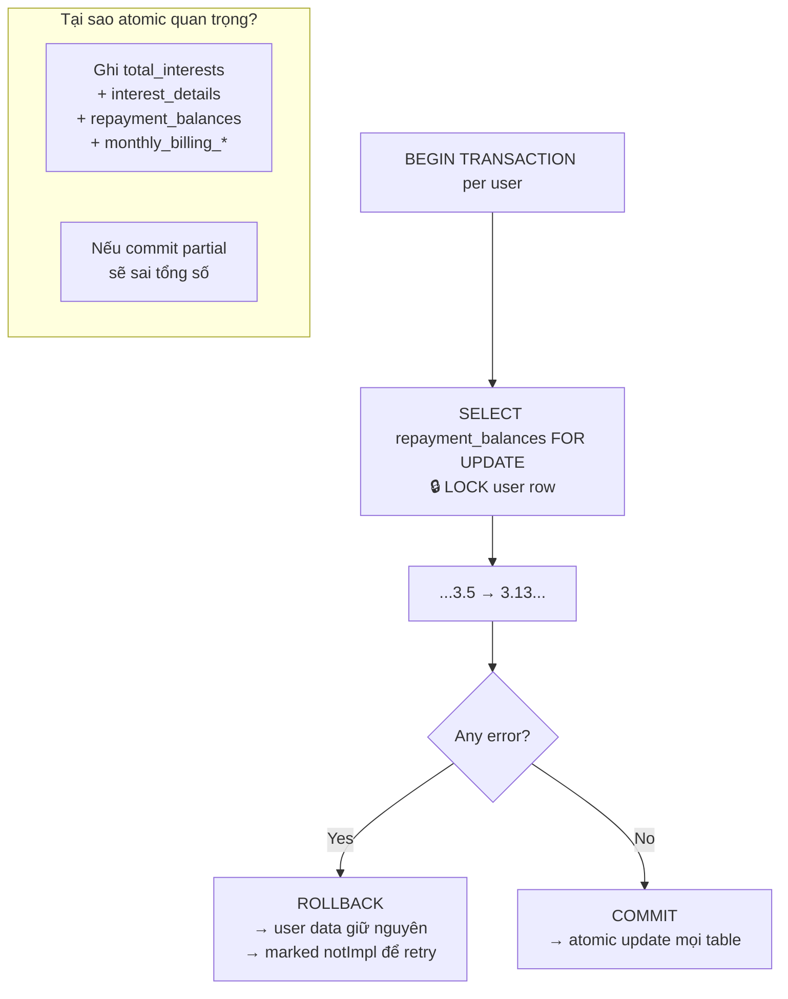

**Business reason:**
- **Atomicity requirement (legal)**: `total_interests` ghi "đã tính lãi" nhưng `repayment_balances.total_repayment_balance` chưa cộng → user bị charge 2 lần khi batch chạy lại.
- **Row-level lock vs table-level**: dùng `FOR UPDATE` trên `repayment_balances` cho từng user → các user khác vẫn chạy parallel.
- **Retry tại user granularity**: 1 user fail không block N-1 users khác.

---

## V2.4 — Ảnh hưởng #820 lên business logic

```mermaid
flowchart TB
    subgraph OldBehavior[Trước #820]
        O1[1000 yen<br/>hardcode cho mọi user]
        O2[Không phân biệt<br/>regular vs VIP]
        O3[Thay đổi phải<br/>deploy code]
    end
    
    subgraph NewBehavior[Sau #820]
        N1[Giá trị config<br/>ở DB]
        N2[User rule override<br/>common rule]
        N3[Thay đổi qua<br/>INSERT/UPDATE SQL]
        N4[Schedule thay đổi<br/>bằng start_month tương lai]
    end
    
    subgraph BusinessValue[Business value]
        B1[Regulation compliance:<br/>Nhanh chóng điều chỉnh<br/>khi luật đổi]
        B2[Customer segmentation:<br/>VIP trả min thấp hơn]
        B3[A/B test:<br/>Thử nghiệm mức base<br/>không cần release]
        B4[Audit: <br/>start_month + pgm_id<br/>→ truy xuất ai/khi nào đổi]
    end
    
    OldBehavior -. #820 .-> NewBehavior
    NewBehavior --> BusinessValue
```

**Tác động tới test:**
- **TC4 (no rule → error)**: đây là **safety guard** — nếu ops quên INSERT rule sau migration, batch fail an toàn thay vì dùng giá trị sai.
- **TC6 (latest rule)**: support schedule — có thể insert rule cho `start_month` tương lai, sẽ tự active khi tới tháng đó.
- **TC3 (rollback)**: đảm bảo không có partial write → user không bị sai data khi config thiếu.

---

## V2.5 — Failure modes & mitigation (business perspective)

| Failure | Tác động business | Mitigation trong code |
|---|---|---|
| DB connection mất giữa chừng | User bị sai billing | Rollback toàn transaction, retry 3 lần (handler.go:94) |
| `common_min_repayment_rules` bị xóa nhầm | Batch fail toàn bộ (blocking) | Error `900801000900204` + retry. Ops phải restore rule. |
| User rule mâu thuẫn common rule | User bị billing sai | Priority hierarchy: user > common (explicit logic tại b.2) |
| Interest rate changed mid-batch | 1 phần user dùng rate cũ, 1 phần rate mới | Batch fetch `interest_rates` mỗi user (consistent trong tx) |
| User có 期失 nhưng cũng OD | Confusion trong xử lý | Priority: Lost (b.1) > OD check → luôn bill full |
| Duplicate batch run (same day) | Double billing / double interest | `total_interests` check existence → UPDATE thay vì INSERT. `monthly_billing_amounts` có unique (user_id, billing_month). |

